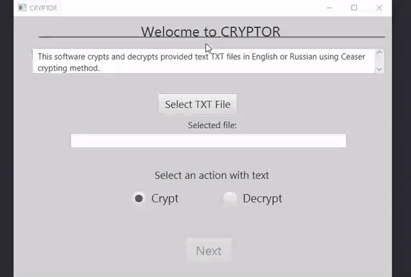

# Cryptor-JavaFX

This **JavaFX** app can crypt any txt file with **Caesar's crypto algorithm**. You can choose
a crypto-key with which you can easily decrypt your file in the future.
You can **save** your new encrypted file in txt format.

For decryption, you can enter the crypto-key or use the **Brute-force method**. 
If there will be several variants you can choose the right one and save the result to txt file.
# How It Works

# How To Start

Simply **run Main.main()** method. The app will start automatically.